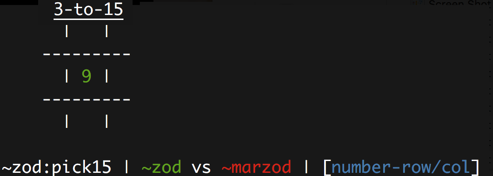
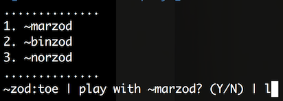

# Number Scrabble/Pick 15/3-to-15 in Urbit

This is a Pick 15 game based on the [tic-tac-toe for urbit](https://github.com/yosoyubik/tic-tac-toe)

## Features

- Network multiplayer.
- Board state printed in the console
- Structures in `/=home=/sur` and marks for updates
- Fixes an [issue](https://github.com/urbit/arvo/issues/1100) with removing the head of a queue using a custom library (`%cola`)
- Notifications for game invitation
- Uses queue instead of list to keep track of incoming and outgoing subscriptions
  - TODO: Research Gall/Hall to replace this
- Pending requests to play are queued and pulled after current game finishes.
- Styled text to print crosses and noughts on board, and game notifications

## Local install

This might take some time to compile, seat tight!

    cp app/pick15.hoon /path/to/your-urbit/home/app
    cp -r mar/pick15 /path/to/your-urbit/home/mar
    cp sur/pick15.hoon /path/to/your-urbit/home/sur
    cp lib/cola.hoon /path/to/your-urbit/home/lib

## Start playing!!

In your urbit's Dojo, run the command:

    ~your-urbit:dojo> |start %pick15

The list of commands are:

- `'~ship-name'`: sends request to ~ship
  - Only if the prompt is `| shall we play a game?`
- `'!'`: cancels the current game. (if any, unqueues next subscription)
- `'l'`: list current subscriptions (any time during the game)
  - 
- `'9-1/1'`: stone (`[1-9]`) and board coordinates (`[1-3/1-3]`)
  - Only if the prompt is `| ~zod vs ~marzod | [number-row/col]`
- `'Y'`: confirm/reject request to play `[Y/N]`
  - Only if the prompt is:
    - `| ~zod wins! continue? (Y/N) |`
    - `| waiting for ~zod (!=quit) |`

## In Progress
- Refactor code
- Follow `/=home=/gen/deco.hoon` best-coding practices (deprecated)
- Follow [code style](https://urbit.org/docs/learn/arvo/style/)
- Remove old three/four letter variable names
- Using Hoonian idioms

## TODO
- Partial board re-paint on each move.
- Web frontend
- Single-player mode
- Send multple requests to multiple ships
- Don't block game waiting for a confirmation
- Cancel a specific request from the list of subscribers
- Write-up a blog post documenting the code

## References

- https://github.com/joshuareagan/doc-drafts/blob/master/Hoon-Ch2-10.md
- https://urbit.org/
- https://www.youtube.com/watch?v=_acTt4_IXYM
